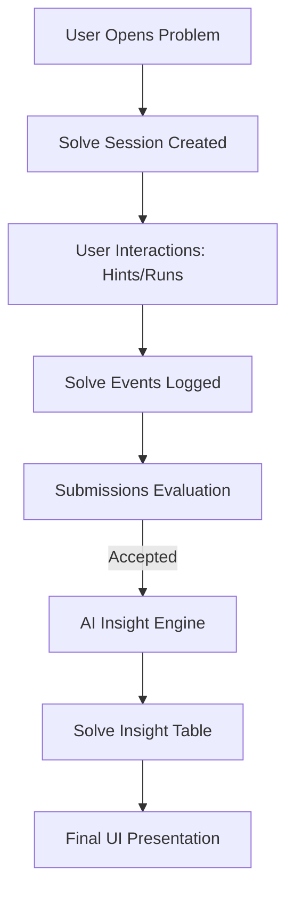

# DevArc System Architecture

## Overview

DevArc is a modular full-stack platform that integrates coding practice, AI-powered guidance, and developer learning analytics. The architecture focuses on premium, high-end user experiences through glassmorphism UI and track-aware AI services.

The platform consists of four main layers:

1. **Frontend App (Next.js 15)**: Glassmorphism UI, Monaco Editor, and real-time AI feedback panels.
2. **Backend API (Node.js/Express)**: Modular services for session management, submissions, and AI prompting.
3. **Database Layer (PostgreSQL)**: Complex relational schema for tracking user events, insights, and career roadmaps.
4. **AI/LLM Layer (Groq/Llama 3.1)**: High-speed inference for hints, reviews, and mock interviews.

---

## 01 / Core Modules

### A. Career Onboarding & Coaching
DevArc begins with an "Elite Persona" onboarding flow.
- **Resume Parser**: Uses `pdf-parse` to extract technical DNA from user resumes.
- **Roadmap Generator**: AI synthesizes a bespoke 3-month plan based on the user's gaps and target role (Frontend, Backend, etc.).

### B. Gamified Solve Engine
The solving workspace is designed to analyze *how* a user thinks, not just if they solved the problem.
- **Session Tracking**: Every hint, code run, and attempt is logged as a `solve_event`.
- **Dynamic Scoring**: Users start with 100 points; AI hints deduct 20 points, gamifying the learning process.
- **Insight Engine**: Post-solve AI analysis that reviews the event timeline to provide deep feedback on the user's logic and resilience.

### C. Mock Interview Module
A professional-grade preparation environment.
- **Track Selection**: DSA, System Design, Frontend Core, or Frameworks.
- **AI Interviewer**: A track-aware agent that conducts a real-time mock session.
- **PDF Reporting**: Uses `jspdf` to transform interview performance (Logic, Quality, Comm.) into a professional downloadable evaluation.

---

## 02 / Frontend Architecture

- **Next.js 15 (App Router)**: Core framework.
- **Tailwind CSS v4**: Styling with premium ZnO-zinc based dark themes.
- **Monaco Editor**: High-performance solution sandbox.
- **Zustand**: Global state for Auth and Workspace sessions.
- **Framer Motion**: Smooth micro-interactions and route transitions.

---

## 03 / Backend Services

- **Auth Service**: Custom session-based JWT authentication.
- **AI Service**: Centralized prompt management for Groq.
- **Insight & Event Service**: Analyzes user behavior for "Solve Insights".
- **Interview Service**: Manages mock sessions and PDF synthesis.
- **Submission Service**: Bridges to Judge0 for code execution.

---

## 04 / Data Flow: Thinking Analysis

---

*DevArc Engineering | System Architecture v4.0 | Production Ready*